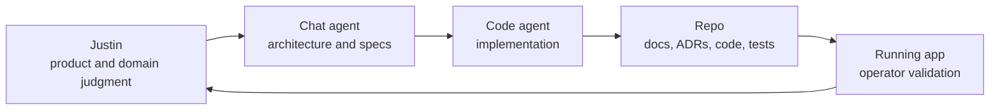

# Operating Model

MindServe also proves a way of building.

Wilds uses an AI-assisted engineering loop where product direction, architecture,
implementation, verification, and documentation stay connected.

## The Loop

## Operating Principles

- Doctrine before execution.
- ADRs capture decisions, not just outcomes.
- Dispatch specs define substantial work before implementation.
- Running-product validation matters more than abstract confidence.
- Documentation is part of done.
- Future handoff is a first-class requirement.

## Why This Is Proof

MindServe is not just a product suite. It is evidence that Justin can coordinate
domain knowledge, architecture, AI-assisted execution, and production validation
into a working software portfolio.

That operating model is part of the asset.
