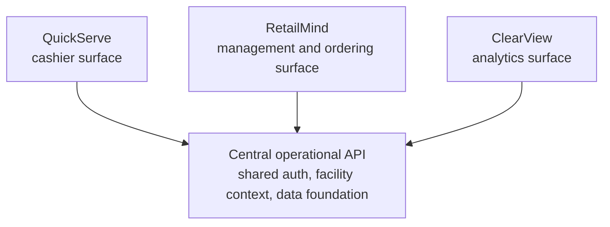

# MindServe Proof

Curated technical proof artifact for MindServe, a Wilds, Inc. cafeteria
operations software suite.

This repository is intentionally **not** the production source tree. It is a
public-reviewable architecture and product-thinking artifact that shows the
suite concept, operating model, deployment posture, and engineering discipline
without exposing the commercially valuable core implementation.

## What MindServe Demonstrates

MindServe is a suite of connected operational surfaces for employee and guest
cafeteria operations:

- a central operational API and data foundation
- a cashier point-of-sale surface
- a management and ordering surface
- an analytics and reporting surface
- shared auth and facility context
- Azure-first deployment
- AI-assisted workflow acceleration where it helps the operator

This proof repo deliberately avoids deep details about inventory engines,
recipe engines, production boards, pull sheets, costing, and import internals.
Those belong in more specific private or curated proof artifacts.

## Suite Map

## Proof Contents

| File | Purpose |
| --- | --- |
| `SUITE_ARCHITECTURE.md` | System-of-systems shape and module relationships |
| `ADR_DIGEST.md` | Selected suite-level decisions, sanitized |
| `OPERATING_MODEL.md` | How Wilds builds and hardens software with agents |
| `SECURITY_AND_TENANCY.md` | Facility isolation and auth posture at a safe level |
| `INTELLIGENCE_LAYER.md` | Strategic +Add Intelligence direction without engine details |
| `CODE_EXCERPTS.md` | Small, sanitized suite-level TypeScript excerpts |
| `PUBLIC_BOUNDARY.md` | What this proof repo intentionally excludes |

## What Is Deliberately Omitted

This proof repo does not include:

- production source code
- endpoint maps sufficient to clone the suite
- database schema details
- inventory, recipe, costing, production, or import internals
- deployment workflows or real resource names
- secrets, environment names, or private URLs
- real customer, facility, employee, or transaction data

## Status

Curated proof artifact. Production MindServe remains private.
