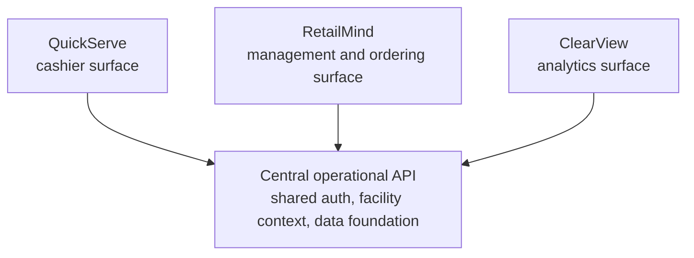

# MindServe Proof

Curated technical proof artifact for MindServe, a Wilds, Inc. cafeteria
operations software suite.

This repository is intentionally **not** the production source tree. It is a
public-reviewable architecture and product-thinking artifact that shows the
suite concept, operating model, deployment posture, security discipline, and
AI-assisted build method without exposing the commercially valuable core
implementation.

## How To Read This Repo

Start here if you are evaluating MindServe technically:

1. Read [WHAT_THIS_PROVES.md](WHAT_THIS_PROVES.md) for the short evaluator view.
2. Read [SUITE_ARCHITECTURE.md](SUITE_ARCHITECTURE.md) for the suite shape.
3. Read [SECURITY_AND_TENANCY.md](SECURITY_AND_TENANCY.md) for the public-safe
   security posture.
4. Read [ADR_DIGEST.md](ADR_DIGEST.md) for decision discipline.
5. Read [OPERATING_MODEL.md](OPERATING_MODEL.md) for the agentic build loop.
6. Read [PUBLIC_BOUNDARY.md](PUBLIC_BOUNDARY.md) before asking why production
   internals are not here.

## What MindServe Demonstrates

MindServe is a suite of connected operational surfaces for employee and guest
cafeteria operations:

- a central operational API and data foundation
- a cashier point-of-sale surface
- a management and ordering surface
- an analytics and reporting surface
- shared auth and facility context
- Azure-first deployment
- AI-assisted workflow acceleration where it helps the operator

This proof repo deliberately avoids deep details about inventory engines,
recipe engines, production boards, pull sheets, costing, and import internals.
Those belong in more specific private or curated proof artifacts.

## Suite Map

## Proof Contents

| File | Purpose |
| --- | --- |
| `WHAT_THIS_PROVES.md` | Short evaluator guide: what the repo is evidence for |
| `SUITE_ARCHITECTURE.md` | System-of-systems shape and module relationships |
| `ADR_DIGEST.md` | Selected suite-level decisions, sanitized |
| `OPERATING_MODEL.md` | How Wilds builds and hardens software with agents |
| `SECURITY_AND_TENANCY.md` | Facility isolation and auth posture at a safe level |
| `INTELLIGENCE_LAYER.md` | Strategic +Add Intelligence direction without engine details |
| `CODE_EXCERPTS.md` | Small, sanitized suite-level TypeScript excerpts |
| `PUBLIC_BOUNDARY.md` | What this proof repo intentionally excludes |
| `PROOF_REPO_STANDARD.md` | Reusable standard for Wilds public proof repos |

## Evaluator Summary

This repo is evidence of:

- suite-level product architecture
- operator-specific interface thinking
- facility-scoped security posture
- ADR-driven decision discipline
- Azure-first delivery habits
- agentic engineering as a repeatable operating model
- disciplined public/private boundaries

## What Is Deliberately Omitted

This proof repo does not include:

- production source code
- endpoint maps sufficient to clone the suite
- database schema details
- inventory, recipe, costing, production, or import internals
- deployment workflows or real resource names
- secrets, environment names, or private URLs
- real customer, facility, employee, or transaction data

## Status

Curated proof artifact. Production MindServe remains private.
