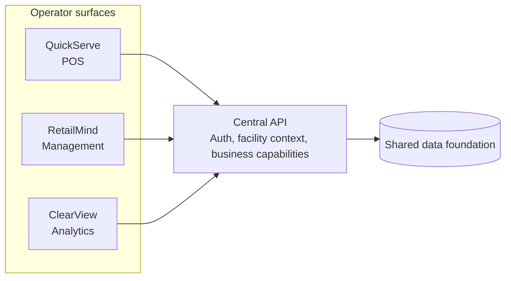

# Suite Architecture

MindServe is designed as a suite, not a single monolithic screen. Each surface
serves a different operator job while relying on a shared operational foundation.

## Application Surfaces

| Surface | Operator job | Shape |
| --- | --- | --- |
| Central API | shared business/data foundation | backend service |
| QuickServe | cashier and line-staff transaction flow | focused POS surface |
| RetailMind | manager workflow and operational control | management surface |
| ClearView | directors and administrators reviewing performance | analytics surface |

## Architecture Shape

## Design Rule

Each surface is allowed to be opinionated for its operator:

- cashier screens optimize for speed and low ambiguity
- manager screens optimize for control and exception handling
- analytics screens optimize for scanning, comparison, and explanation

The shared API keeps the data foundation coherent while the surfaces remain
purpose-built.

## Deployment Posture

The suite is Azure-first:

- backend as a managed web service
- frontends as static web apps
- GitHub Actions for deployment
- environment configuration outside source control
- production source remains private

This proof repo intentionally avoids real resource names and workflow files.

## Why This Matters

Operational software fails when every user is forced through one generic
interface. MindServe's suite shape keeps the foundation unified while letting
each operator use a surface built for their actual job.
